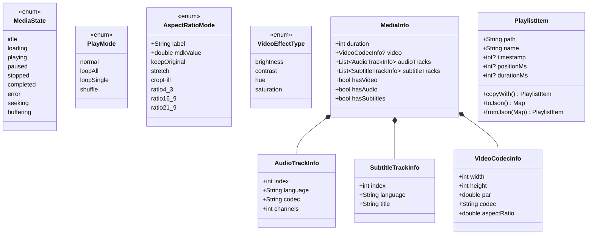
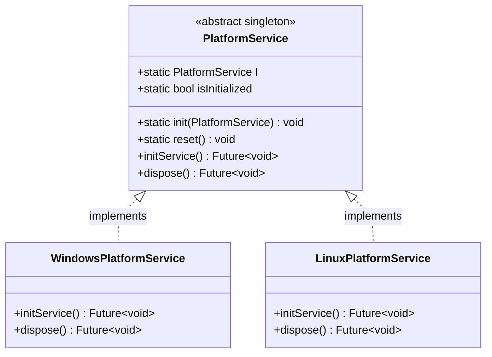
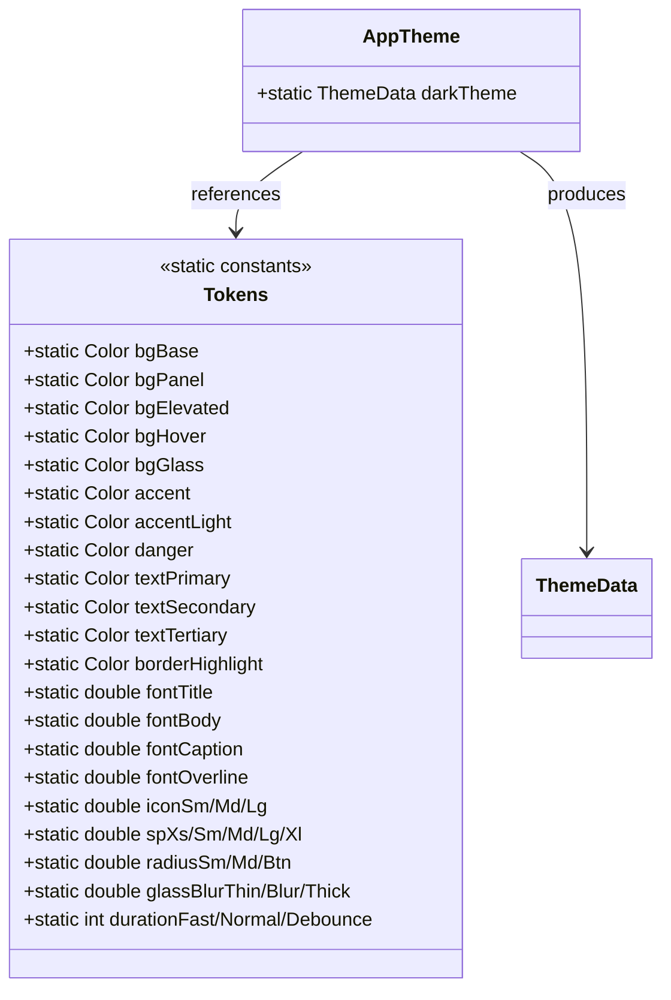
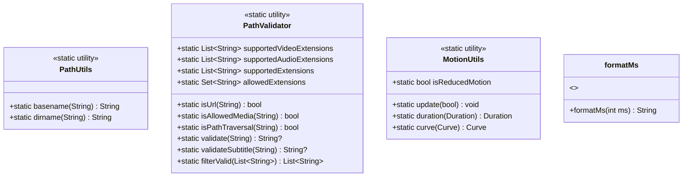

# Simple Player Flutter — Kernel Architecture

## 1. Directory Structure

```
lib/kernel/
├── engine/                    # 播放引擎层 (MDK/FFmpeg 抽象)
│   ├── media_engine.dart        177L  abstract MediaEngine
│   ├── fvp_engine.dart          546L  FvpEngine implements MediaEngine
│   ├── fvp_callback_handler.dart 100L  FvpCallbackHandler
│   ├── position_poller.dart      74L  PositionPoller
│   └── track_manager.dart        70L  TrackManager
├── models/                    # 数据模型层
│   ├── media_state.dart          32L  enum MediaState (9 states)
│   ├── media_info.dart           71L  MediaInfo, AudioTrackInfo, SubtitleTrackInfo, VideoCodecInfo
│   ├── playlist_item.dart        72L  PlaylistItem
│   ├── play_mode.dart            10L  enum PlayMode (4 modes)
│   ├── aspect_ratio_mode.dart    17L  enum AspectRatioMode (6 modes)
│   └── video_effect_type.dart     7L  enum VideoEffectType (4 effects)
├── services/                  # 业务服务层
│   ├── playback_controller.dart  49L  PlaybackController (orchestrator)
│   ├── playback_navigator.dart  141L  mixin PlaybackNavigator
│   ├── state_monitor.dart       147L  mixin StateMonitor
│   ├── file_operations.dart      81L  mixin FileOperations
│   ├── video_processing_service.dart 121L  VideoProcessingService
│   └── platform_service.dart     41L  abstract PlatformService (singleton)
├── persistence/               # 持久化层
│   ├── settings_store.dart      314L  SettingsStore + AppSettings
│   └── playlist_store.dart      172L  PlaylistStore
├── playlist/                  # 播放列表模型
│   └── playlist.dart           310L  Playlist
├── platform/                  # 平台适配层
│   ├── windows_platform_service.dart  13L  WindowsPlatformService
│   └── linux_platform_service.dart    12L  LinuxPlatformService
├── ui/                        # 内核 UI
│   └── theme/
│       ├── tokens.dart          53L  Tokens (33 static const)
│       └── app_theme.dart       26L  AppTheme → ThemeData bridge
└── utils/                     # 工具层
    ├── path_utils.dart          42L  PathUtils (basename/dirname)
    ├── path_validator.dart      91L  PathValidator (security validation)
    ├── time_utils.dart          12L  formatMs()
    └── motion_utils.dart        28L  MotionUtils (reduced-motion)
```

---

## 2. Layer Architecture (自顶向下)

```
┌─────────────────────────────────────────────────────────────────────┐
│                        APP LAYER (lib/)                             │
│   main.dart → App (StatefulWidget) → _AppState                      │
│   组装: FvpEngine + Playlist + PlaybackController                    │
└──────────────────────────────┬──────────────────────────────────────┘
                               │ 依赖注入
┌──────────────────────────────▼──────────────────────────────────────┐
│                    SERVICES LAYER (kernel/services/)                 │
│                                                                      │
│   ┌──────────────────────────────────────────────┐                   │
│   │         PlaybackController (concrete)         │                   │
│   │   with FileOperations + PlaybackNavigator     │                   │
│   │              + StateMonitor                    │                   │
│   └──────────────────────────────────────────────┘                   │
│                      ▲  mixins                                      │
│   ┌────────────┐  ┌───────────────┐  ┌──────────────┐               │
│   │FileOperations│ │PlaybackNavigator│ │ StateMonitor │               │
│   │  (mixin)   │  │   (mixin)      │  │  (mixin)    │               │
│   └────────────┘  └───────────────┘  └──────────────┘               │
│                                                                      │
│   ┌──────────────────────┐  ┌──────────────────┐                    │
│   │VideoProcessingService│  │ PlatformService   │                    │
│   │    (concrete)        │  │   (abstract)      │                    │
│   └──────────────────────┘  └──────────────────┘                    │
└────┬──────────┬───────────────┬──────────────┬───────────────────────┘
     │          │               │              │
┌────▼────┐ ┌──▼────────┐ ┌───▼──────┐ ┌─────▼──────┐
│ ENGINE  │ │  MODELS   │ │PERSISTENCE│ │  PLATFORM  │
│  LAYER  │ │  LAYER    │ │  LAYER   │ │   LAYER    │
└─────────┘ └───────────┘ └──────────┘ └────────────┘
```

---

## 3. Engine Layer — 播放引擎层

```mermaid
classDiagram
    class MediaEngine {
        <<abstract>>
        +ValueNotifier~int?~ textureId
        +ValueNotifier~MediaState~ state
        +ValueNotifier~int~ position
        +ValueNotifier~int~ duration
        +ValueNotifier~double~ volume
        +ValueNotifier~bool~ isMuted
        +ValueNotifier~bool~ isBuffering
        +ValueNotifier~String~ subtitleText
        +ValueNotifier~int~ buffered
        +ValueNotifier~double~ aspectRatio
        +ValueNotifier~String?~ errorMessage
        +ValueNotifier~double~ playbackSpeed
        +ValueNotifier~String~ activeDecoder
        +bool supportsHwAccel
        +MediaInfo mediaInfo
        +List~int~ activeAudioTracks
        +int subtitleDelay
        +open(String path) Future~void~
        +play() void
        +pause() void
        +stop() void
        +seekTo(int ms) Future~void~
        +setVolume(double) void
        +setMute(bool) void
        +togglePlayPause() void
        +skipForward(int seconds) void
        +skipBack(int seconds) void
        +setPlaybackRate(double) void
        +setRange(int from, int to) void
        +getAudioTracks() List~AudioTrackInfo~
        +switchAudioTrack(int) void
        +getSubtitleTracks() List~SubtitleTrackInfo~
        +switchSubtitleTrack(int) void
        +toggleSubtitle() void
        +setExternalSubtitle(String) void
        +setSubtitleDelay(int) void
        +setEqualizer(String) void
        +setVideoEffect(VideoEffectType, double) void
        +rotate(int) void
        +setAspectRatio(double) void
        +setDeinterlace(bool) void
        +dispose() void
    }

    class FvpEngine {
        -mdk.Player _player
        -late FvpCallbackHandler _callbackHandler
        -late PositionPoller _positionPoller
        -late TrackManager _trackManager
        +FvpEngine()
        +open(String path) Future~void~
        +play() void
        +pause() void
        +stop() void
        ... (全部 MediaEngine 接口实现)
    }

    class FvpCallbackHandler {
        -mdk.Player _player
        +ValueNotifier~MediaState~ state
        +ValueNotifier~bool~ isBuffering
        +VoidCallback onStopPositionPolling
        +FvpCallbackHandler(mdk.Player, {state, isBuffering, onStopPositionPolling})
        +init() void
        +dispose() void
        +static mapMdkState(mdk.PlaybackState) MediaState
    }

    class PositionPoller {
        -mdk.Player _player
        +ValueNotifier~int~ position
        +ValueNotifier~int~ buffered
        +String Function() currentPathGetter
        +set seeking(bool)
        +start() void
        +stop() void
        +dispose() void
    }

    class TrackManager {
        -mdk.Player _player
        +MediaInfo mediaInfo
        +List~int~ activeAudioTracks
        +updateMediaInfo(MediaInfo) void
        +getAudioTracks() List~AudioTrackInfo~
        +switchAudioTrack(int) void
        +getSubtitleTracks() List~SubtitleTrackInfo~
        +switchSubtitleTrack(int) void
        +toggleSubtitle() void
    }

    MediaEngine <|.. FvpEngine : implements
    FvpEngine *-- FvpCallbackHandler : composes
    FvpEngine *-- PositionPoller : composes
    FvpEngine *-- TrackManager : composes
```

---

## 4. Services Layer — 业务服务层

```mermaid
classDiagram
    class PlaybackController {
        +MediaEngine engine
        +Playlist playlist
        +ValueNotifier~String~ currentFileName
        +VoidCallback onNeedRebuild
        +Function~Object~? onError
        +PlaybackController({engine, playlist, onNeedRebuild, onError})
        +savePlaylist() void
        +dispose() void
    }

    class PlaybackNavigator {
        <<mixin>>
        +int openGeneration
        +int currentGeneration
        +playIndex(int index) Future~void~
        +playNext() Future~void~
        +playPrevious() Future~void~
    }

    class StateMonitor {
        <<mixin>>
        +init() Future~void~
        +removeAt(int) Future~void~
        +reorder(int old, int new) void
        +clearPlaylist() void
        +togglePlayMode() void
        +dispose() void
    }

    class FileOperations {
        <<mixin>>
        +ValueNotifier~String?~ validationError
        +disposeValidation() void
        +openAndPlay(String path) Future~bool~
        +addFiles(List~String~ paths) Future~int~
    }

    class VideoProcessingService {
        -MediaEngine _engine
        +ValueNotifier~double~ brightness
        +ValueNotifier~double~ contrast
        +ValueNotifier~double~ saturation
        +ValueNotifier~double~ hue
        +ValueNotifier~bool~ deinterlaceEnabled
        +ValueNotifier~int~ rotation
        +ValueNotifier~AspectRatioMode~ aspectRatioMode
        +VideoProcessingService(MediaEngine, {AppSettings?})
        +resetAll() void
        +dispose() void
    }

    class PlatformService {
        <<abstract>>
        +static PlatformService I
        +static bool isInitialized
        +static init(PlatformService impl) void
        +static reset() void
        +initService() Future~void~
        +dispose() Future~void~
    }

    PlaybackController ..|> PlaybackNavigator : with
    PlaybackController ..|> StateMonitor : with
    PlaybackController ..|> FileOperations : with

    PlaybackNavigator --> MediaEngine : uses
    PlaybackNavigator --> Playlist : uses
    StateMonitor --> MediaEngine : uses
    StateMonitor --> Playlist : uses
    StateMonitor --> SettingsStore : reads/writes
    FileOperations --> MediaEngine : uses
    FileOperations --> Playlist : uses
    FileOperations --> PathValidator : validates
    VideoProcessingService --> MediaEngine : delegates effects
    VideoProcessingService --> SettingsStore : persists
```

### PlaybackController Mixin 组合详解

```
PlaybackController
    ├── FileOperations (mixin)
    │   ├── 依赖: engine, playlist, currentFileName, onNeedRebuild, playIndex(), savePlaylist()
    │   └── 提供: openAndPlay(), addFiles(), validationError
    │
    ├── PlaybackNavigator (mixin)
    │   ├── 依赖: engine, playlist, currentFileName, onNeedRebuild, onError, savePlaylist()
    │   └── 提供: playIndex(), playNext(), playPrevious(), openGeneration
    │
    └── StateMonitor (mixin)
        ├── 依赖: engine, playlist, currentFileName, onNeedRebuild, onError, playIndex(), playNext(), savePlaylist()
        └── 提供: init(), removeAt(), reorder(), clearPlaylist(), togglePlayMode(), dispose()
```

---

## 5. Models Layer — 数据模型层



---

## 6. Playlist — 播放列表

```mermaid
classDiagram
    class Playlist {
        -List~PlaylistItem~ _items
        -int _currentIndex
        -PlayMode _mode
        -Random _random
        +List~PlaylistItem~ items
        +int length
        +int currentIndex
        +PlayMode mode
        +bool isEmpty
        +bool isNotEmpty
        +PlaylistItem? current
        +bool hasNext
        +bool hasPrevious
        +add(String path) int
        +addItem(PlaylistItem) int
        +addAll(List~String~) void
        +removeAt(int) bool
        +reorder(int old, int new) void
        +clear() void
        +updateHistory(int, {positionMs, durationMs}) void
        +updatePosition(int, int, int?) void
        +mergeHistory(Map) void
        +peekNext() int
        +peekPrevious() int
        +toJson() Map
        +fromJson(Map) Playlist
    }

    Playlist *-- PlaylistItem : contains
    Playlist --> PlayMode : uses
```

---

## 7. Persistence Layer — 持久化层

```mermaid
classDiagram
    class SettingsStore {
        <<static utility>>
        -SharedPreferences _cachedPrefs
        +static prewarm(SharedPreferences) void
        +static resetPrewarm() void
        +static load() Future~AppSettings~
        +static saveVolume(double) Future~void~
        +static saveLastFile(String) Future~void~
        +static saveWindowGeometry({w,h,x,y,maximized}) Future~void~
        +static savePlayMode(int) Future~void~
        +static saveIsMuted(bool) Future~void~
        +static saveIsMaximized(bool) Future~void~
        +static saveIsAlwaysOnTop(bool) Future~void~
        +static saveIsFullscreen(bool) Future~void~
        +static loadLocale() Future~String~
        +static saveLocale(String) Future~void~
        +static saveSubtitleFontSize(double) Future~void~
        +static saveSubtitleColorIndex(int) Future~void~
        +static saveSubtitleBottomOffset(double) Future~void~
        +static saveVideoBrightness(double) Future~void~
        +static saveVideoContrast(double) Future~void~
        +static saveVideoSaturation(double) Future~void~
        +static saveVideoHue(double) Future~void~
        +static saveVideoRotation(int) Future~void~
        +static saveVideoAspectRatioIndex(int) Future~void~
        +static saveVideoDeinterlace(bool) Future~void~
        +static saveAll(AppSettings) Future~void~
    }

    class AppSettings {
        <<immutable data>>
        +final double volume
        +final String lastFile
        +final double windowWidth
        +final double windowHeight
        +final double? windowX
        +final double? windowY
        +final bool isMaximized
        +final int playMode
        +final bool isMuted
        +final bool isAlwaysOnTop
        +final bool isFullscreen
        +final double subtitleFontSize
        +final int subtitleColorIndex
        +final double subtitleBottomOffset
        +final double videoBrightness
        +final double videoContrast
        +final double videoSaturation
        +final double videoHue
        +final int videoRotation
        +final int videoAspectRatioIndex
        +final bool videoDeinterlace
    }

    class PlaylistStore {
        <<static utility>>
        +static save(Playlist) void
        +static load() Future~Playlist?~
        +static clear() Future~void~
        +static dispose() Future~void~
        +static reset() void
    }

    SettingsStore ..> AppSettings : produces
    SettingsStore --> SharedPreferences : reads/writes
    PlaylistStore --> Playlist : serializes
    PlaylistStore --> File : reads/writes JSON
```

---

## 8. Platform Layer — 平台适配层



---

## 9. UI Theme — 设计系统



---

## 10. Utils Layer — 工具层



---

## 11. 完整依赖关系图

```
main.dart
  └─→ App (StatefulWidget)
       └─→ _AppState
            ├─→ FvpEngine (implements MediaEngine)
            │    ├─→ FvpCallbackHandler
            │    ├─→ PositionPoller
            │    └─→ TrackManager
            ├─→ Playlist
            │    └─→ PlaylistItem
            ├─→ PlaybackController (with 3 mixins)
            │    ├─→ FileOperations
            │    │    └─→ PathValidator
            │    ├─→ PlaybackNavigator
            │    │    └─→ PathValidator
            │    └─→ StateMonitor
            │         └─→ SettingsStore ←→ SharedPreferences
            ├─→ PlaylistStore ←→ File (JSON)
            ├─→ VideoProcessingService
            │    └─→ SettingsStore
            ├─→ PlatformService (singleton)
            │    ├─→ WindowsPlatformService
            │    └─→ LinuxPlatformService
            └─→ AppTheme → Tokens
```

---

## 12. 核心接口清单

| # | 接口/类 | 类型 | 文件 | 行数 | 核心职责 |
|---|---------|------|------|------|----------|
| 1 | `MediaEngine` | abstract | `engine/media_engine.dart` | 177 | 播放引擎契约: 13个ValueNotifier + 25个方法 |
| 2 | `FvpEngine` | concrete | `engine/fvp_engine.dart` | 546 | MDK/FFmpeg 实现 |
| 3 | `FvpCallbackHandler` | concrete | `engine/fvp_callback_handler.dart` | 100 | MDK 状态回调映射 |
| 4 | `PositionPoller` | concrete | `engine/position_poller.dart` | 74 | 200ms 位置轮询 |
| 5 | `TrackManager` | concrete | `engine/track_manager.dart` | 70 | 音轨/字幕轨管理 |
| 6 | `PlaybackController` | concrete | `services/playback_controller.dart` | 49 | 服务编排器 (3 mixin 组合) |
| 7 | `PlaybackNavigator` | mixin | `services/playback_navigator.dart` | 141 | 播放导航 (index/next/prev) |
| 8 | `StateMonitor` | mixin | `services/state_monitor.dart` | 147 | 状态监听 + 持久化 |
| 9 | `FileOperations` | mixin | `services/file_operations.dart` | 81 | 文件打开/批量添加 |
| 10 | `VideoProcessingService` | concrete | `services/video_processing_service.dart` | 121 | 亮度/对比度/饱和度/色调/旋转/去隔行/宽高比 |
| 11 | `PlatformService` | abstract | `services/platform_service.dart` | 41 | 平台抽象 (singleton) |
| 12 | `SettingsStore` | static | `persistence/settings_store.dart` | 314 | SharedPreferences 封装 |
| 13 | `PlaylistStore` | static | `persistence/playlist_store.dart` | 172 | JSON 文件持久化 |
| 14 | `Playlist` | concrete | `playlist/playlist.dart` | 310 | 播放列表模型 + 4种播放模式 |
| 15 | `Tokens` | static | `ui/theme/tokens.dart` | 53 | 33个设计令牌 |
| 16 | `AppTheme` | static | `ui/theme/app_theme.dart` | 26 | ThemeData 桥接 |

---

## 13. 数据流

```
用户操作 → PlaybackController → PlaybackNavigator → MediaEngine → FvpEngine → mdk.Player
                                      │                                    │
                                      ▼                                    ▼
                                 Playlist                             FvpCallbackHandler
                                      │                                    │
                                      ▼                                    ▼
                              PlaylistStore (JSON)                   StateMonitor
                                      │                                    │
                                      ▼                                    ▼
                                 文件系统                            SettingsStore → SharedPreferences
```

**状态变更通知流:**
```
mdk.Player → FvpCallbackHandler → ValueNotifier<MediaState> → StateMonitor._onStateChanged()
                                          │
                                          ▼
                              ValueListenableBuilder (UI rebuilds)
```

---

## 14. 枚举定义汇总

| 枚举 | 文件 | 值 |
|------|------|-----|
| `MediaState` | `models/media_state.dart` | idle, loading, playing, paused, stopped, completed, error, seeking, buffering |
| `PlayMode` | `models/play_mode.dart` | normal, loopAll, loopSingle, shuffle |
| `AspectRatioMode` | `models/aspect_ratio_mode.dart` | keepOriginal, stretch, cropFill, ratio4_3, ratio16_9, ratio21_9 |
| `VideoEffectType` | `models/video_effect_type.dart` | brightness, contrast, hue, saturation |
